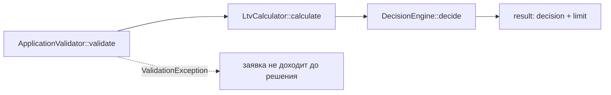

Файлы не меняю — только разбор. Все цитаты с номерами строк.

## 1. Как считается решение: файлы, функции, порядок

Сборка (вне Domain, но именно тут правила попадают в код) — `backend/src/AppFactory.php:27–41`: `rules.php` подключается через `require` (строка 27) и раздаётся по компонентам: `ApplicationValidator` получает весь `$rules` + `VinValidator($rules['vin'])` + `VehicleAge(год)`, а `DecisionEngine` — **только** `$rules['ltv']` (строка 37).

Сам расчёт — один метод `AssessmentService::assess()` (`AssessmentService.php:28–42`), четыре шага по порядку:

1. **`ApplicationValidator::validate($payload)`** (`ApplicationValidator.php:24–83`) — проверяет заявку по `rules.php`: VIN через `VinValidator::isValid()` (длина 17, A–Z0–9, без I/O/Q — `VinValidator.php:18–37`); год: не раньше 1990, не из будущего и не старше 20 лет через `VehicleAge::inYears()` (`VehicleAge.php:18–21`, простой `currentYear - productionYear`); пробег (см. п. 3); стоимость > 0; сумма 50 000–2 000 000; срок 3–48 мес. Любая ошибка → `throw ValidationException` (`ValidationException.php:9–15`), до решения заявка не доходит. Успех → нормализованный массив `{vin, year, mileage, market_value, requested_amount, term_months}` (строки 75–82).
2. **`LtvCalculator::calculate($requestedAmount, $marketValue)`** (`LtvCalculator.php:15–26`) — `round(сумма / стоимость * 100, 2)`. Внутри есть защиты от нуля/отрицательных значений (строки 17–24), но после валидатора они недостижимы.
3. **`DecisionEngine::decide(float $ltv)`** (`DecisionEngine.php:30–41`) — единственное место, где рождается решение. Пороги из конструктора: `approve_max = 60.0`, `review_max = 85.0` (`rules.php:43–46`):
    - `LTV < 60.0` → `approve` (строка 32–34)
    - `60.0 ≤ LTV ≤ 85.0` → `review` (строки 36–38)
    - `LTV > 85.0` → `reject` (строка 40)
4. **Результат** (`AssessmentService.php:35–41`) — массив: `vehicle_age` (снова через `VehicleAge`), `ltv`, `decision`, `approved_limit` (запрошенная сумма при `approve`, иначе 0), `input`.

Важно: в `decide()` уходит **только число LTV** — ни пробег, ни год, ни срок на решение не влияют. `ltv_by_age` (`rules.php:53–58`) заполнен, но в решении не участвует — в комментарии прямо указано, что это задача LOAN-12, она не сделана.

## 2. Куда встанет правило «пробег ≤ 400 000 км, иначе review»

**Функция:** `DecisionEngine::decide()` — это единственная точка выбора решения. Место: после LTV-каскада (после строки 34 / перед возвратом `reject` на строке 40) — сначала решение по LTV, затем пересечение с условием по пробегу. Равнозначная альтернатива по текущей структуре — `AssessmentService::assess()` строка 33, сразу после `$decision = $this->decisionEngine->decide($ltv)`: там уже есть `$input['mileage']`.

**Какие входные данные уже есть:**
- Нормализованный `mileage` (int, проверенный диапазон 0–500 000) — `ApplicationValidator.php:43–46, 78`, в `assess()` доступен как `$input['mileage']`.
- Секция `'vehicle'` в `rules.php:20–24`, куда логично добавить порог (например, `mileage_review_over_km => 400000`) — по AGENTS.md число в коде хардкодить нельзя, только конфиг.
- Паттерн передачи правил: `AppFactory.php:27, 32, 37`.

**Чего не хватает:**
- Порога 400 000 в `rules.php` — нет, такого ключа нет, ближайший `max_mileage_km = 500000` — это валидация, не решение.
- Пробега в `DecisionEngine`: сигнатура `decide(float $ltv)` пробег не принимает — нет; в конструкторе поля под порог нет (только `approveMax`/`reviewMax` из `$rules['ltv']`).
- Передачи нового ключа в `DecisionEngine` на сборке — `AppFactory.php:37` передаёт только `$rules['ltv']`.
- Тестов на решение по пробегу — нет: в тестах `mileage` встречается дважды и только как обычное значение заявки (`ApplicationValidatorTest.php:34` — 84 000, `AssessmentServiceTest.php:38` — 96 000), решений по пробегу тесты не проверяют.
- Определённости с `reject`: что делать при LTV > 85 и пробеге > 400 000 — в коде нет ничего, это вопрос постановки, не кода.

## 3. Что уже сейчас проверяется про пробег

Ровно одна проверка — `ApplicationValidator.php:43–46`: пробег целое число от 0 до `rules['vehicle']['max_mileage_km']` (500 000). Нарушение → ошибка `'Пробег от 0 до 500000 км'` в `ValidationException`, заявка до решения не доходит. То есть: свыше 500 000 км отсекается валидацией, а в диапазоне 0–500 000 пробег на решение **никак не влияет**. Других упоминаний пробега в Domain и `rules.php` нет; в БД репозиторий его, судя по структуре, хранит, но это вне заданного scope (`backend/src/Repository/` не смотрел — нет).